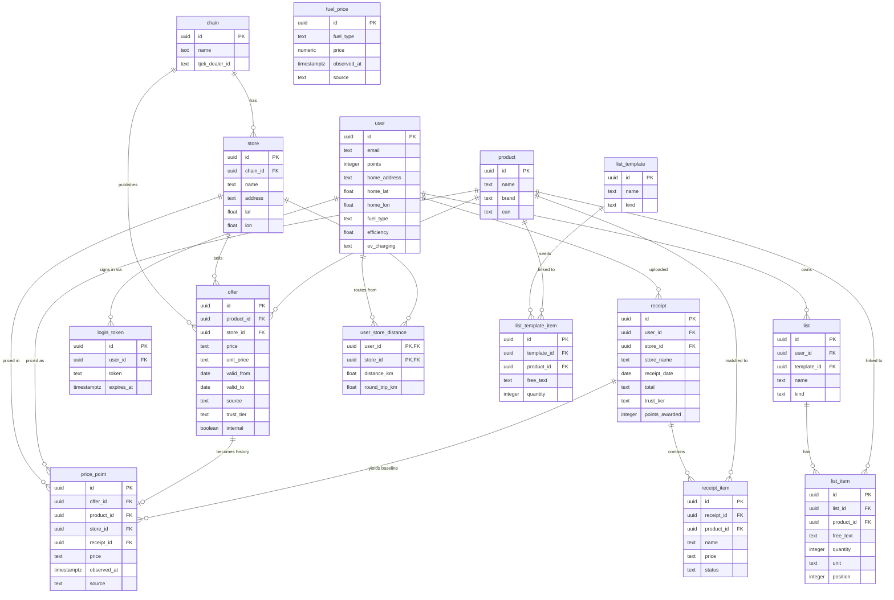

# Kurven (Grocery Price Watcher)

**Denmark's grocery price watcher.** Build a shopping list (or a recipe, or a cleaning cupboard), and see **which store is cheapest for your whole basket this week** — with user-reported receipt prices filling in what the flyers don't cover.

Working name: **Kurven** ("the basket"). Codebase + repo still `price-watcher`.

## What it does

- **Lists** — create shopping lists, recipes, or cleaning cupboards. Items are product-linked (so they can be priced) or free-text with a structured quantity.
- **Recipe import** — paste a recipe, map its ingredients to products, save as a list. (Manual mapping, not AI parsing.)
- **Templates** — 8 curated Danish templates (lasagne, frikadeller, taco-fredag…) — "Use template" clones one into your own list.
- **Store comparison** — the core: for any list, which store is cheapest this week, and by how much. Offer prices and user-reported prices are shown separately.
- **Receipt scanning** — photograph a supermarket receipt, OCR extracts the line items, and they become baseline prices _and_ your personal spending history.
- **Your spending** — monthly total by store, from your own receipts.
- **Gamification** — points + streaks for uploading receipts. Points once per physical receipt; a cleaner re-scan upgrades, never re-awards.
- **Price vs. average** — each scanned receipt line shows whether you paid above or below the going rate.
- **Madplan** — plan a week of meals under a budget; the app assembles meals from templates and picks the cheapest store, with a shareable output.
- **Travel cost** — "is it worth the detour?" Basket + round-trip fuel per store, with a net-win verdict (petrol/diesel/EV, home vs public charging).

## Stack

SolidStart 2 · Solid 1.9 · TypeScript · TailwindCSS 4 · Kysely · PostgreSQL · Vite+ (`vp` toolchain) · Nitro · Tesseract (Danish OCR) · node-cron

## Database



**Key design points:**

- **`offer`** carries the feed's official prices; **`price_point`** holds every observed price (offer history + receipt baselines). `price_point.source` distinguishes `offer` vs `receipt`; `offer.internal` flags feed rows as not-publishable (the data & legal boundary).
- **`receipt` → `price_point`** is the crowd-data moat: receipt-derived baselines power basket math, spending, and price-vs-average.
- **`user_store_distance`** has a composite PK `(user_id, store_id)` — the OSRM round-trip distance cache.
- `product` is the hub — lists, receipts, offers, and baselines all link to it.

## Project status

- **Phase 0–5 done** — data access spike, ingestion pipeline, the receipt pipeline (OCR → upload → baselines → spending → gamification → price-vs-average), lists/basket math/madplan, and travel cost (OSRM round-trip + fuel verdict). 101+ tests passing.
- **Phase 6 in progress** — crowd data + trust tiers (report a price, GasBuddy trust model, report gamification, moderation).
- **Roadmap** — closed beta (7), design polish (7b), launch (8), agent layer (9), Tjek-independent ingestion (10, conditional). See `docs/reference/build-plan.md`.

## Setup

Follow **`docs/setup-dev.md`** to get the project running (Postgres, `.env`, `vp install`, migrations). For a brand-new machine, start with **`docs/bootstrap-new-machine.md`**.

Once set up: `vp dev` (dev server) · `vp check` (format/lint/type) · `vp test` (tests) · `vp build` + `pnpm start` (production).

## Deployment

Production is a **single Nitro server process** — the app, the receipt OCR worker, and the offer/fuel ingestion scheduler all run inside it. No separate scheduler process to keep alive.

1. Provision a box with Node >= 24, Postgres, and the repo clone (see `docs/bootstrap-new-machine.md`).
2. Create `.env` (see below for the full set of vars).
3. `pnpm db:migrate` — apply Kysely migrations (idempotent, safe to re-run).
4. `vp build` — Nitro bundles the site _and_ the background jobs into `.output/`.
5. `node .output/server/index.mjs` — one process serves the site, scans receipts (30 s poll), ingests offers (~6 h cadence) and refreshes fuel prices (daily).

Optional on-demand ingest: `pnpm ingest:run` forces an immediate offer + fuel refresh without waiting for the cron tick.

**Env vars:** `DATABASE_URL` (Postgres) and `TJEK_BASE_URL` (Tjek read API) are the essentials. For sign-in you also need `SESSION_SECRET` (>= 32 chars) and `ORIGIN` (the public URL, e.g. `https://beta.skujeg.dk` — important behind a reverse proxy). `UPLOAD_DIR` points at the persistent receipt-image directory. `DISABLE_INGEST_SCHEDULER=1` and `DISABLE_RECEIPT_WORKER=1` turn off the in-app background jobs (useful in dev or while debugging).

**Keeping it alive:** background jobs start lazily with the Nitro runtime (on the first HTTP request). Run the single process under pm2 or systemd to restart on crash/boot — there is nothing else to supervise.

## Routes you should visit

Everything under `PREFIX` (default: `http://localhost:3000`).

| Route            | What it is                                                                            | Sign-in  |
| ---------------- | ------------------------------------------------------------------------------------- | -------- |
| `/`              | **Current offers** — offers index, filter by chain                                    | public   |
| `/products/[id]` | **Product page** — current offers + user-reported baseline prices, trust-tier badges  | public   |
| `/stores/[id]`   | **Store page** — a store's current offers                                             | public   |
| `/about`         | About page                                                                            | public   |
| `/signin`        | **Magic-link sign-in** — request an email OTP code                                    | —        |
| `/upload`        | **Upload a receipt** — photograph → OCR → line items → baselines + points             | required |
| `/spending`      | **Your spending** — monthly total, by store, recent receipts                          | required |
| `/lists`         | **Your lists** + the templates to start from                                          | required |
| `/lists/import`  | **Recipe import** — paste a recipe, map ingredients, save as a list                   | required |
| `/lists/[id]`    | **List detail** — add/edit/remove/reorder items                                       | required |
| `/compare/[id]`  | **Store comparison** — cheapest store for this list + savings + fuel-adjusted verdict | required |
| `/madplan`       | **Weekly madplan** — plan N days of meals under a budget, cheapest store + share      | required |
| `/settings`      | **Settings** — home address (travel cost) + car profile (fuel type, efficiency, EV)   | required |
| `/receipts/[id]` | **Receipt detail** — line-by-line price vs. average                                   | required |

**The two to try first:** `/` (current offers) and, once signed in, `/lists` → pick a template → `/compare/[id]` to see the store ranking (now with fuel-adjusted totals once you set a home address + car in `/settings`). `/upload` + `/spending` show the receipt/retention loop, and `/madplan` is the budget planner.

## Data & honesty

- **Offer prices** come from the Tjek.com read API (all Danish chains). **User-reported prices** come from real receipts and are labeled as such — never presented as official offers or "discounts."
- Feed data is internal-only; crowd/receipt data is the publishable layer. See the data & legal boundary in `docs/reference/build-plan.md`.

## Repo layout

```
src/routes/     SolidStart routes (offers, products, stores, lists, compare, receipts, upload, spending)
src/lib/        Pure logic: OCR classifier, receipt OCR, basket cost, recipe parsing, product matching, unit price, dedup, points
src/server/     Server handlers: auth, lists, receipt-upload, queries, ingestion scheduler
src/db/         Kysely schema + migrations
tasks/          Self-contained coding task files (implement these)
docs/           Setup, new-machine bootstrap, reference (build plan, chains)
```
